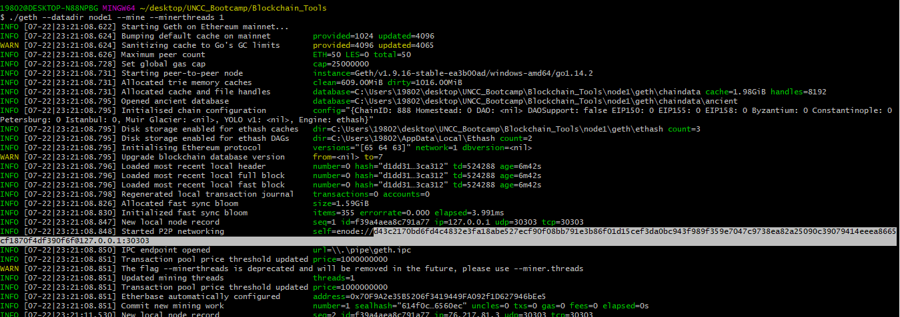
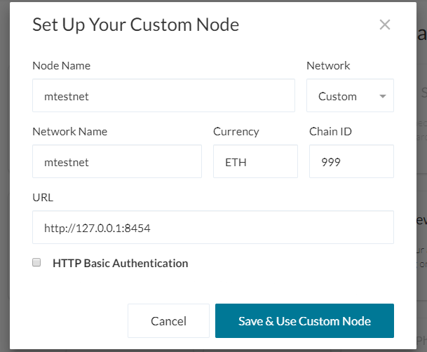

## Proof of Authority Blockchain Manual
---
Private BlockChain testnet for developer team to use and explore potentials for blockchain at ZBank.


## Background
---
ZBank is a small, innovative bank that is interested in exploring what blockchain technology can do for them and their customers.

This project is to set up a private blockchain testnet for the team of developers so we can use to explore potentials for blockchain at ZBank.

Set up a testnet as there is no real money involved, which will give our team of developers the freedom to experiment. Testnets allows for offline development.

Tokens inherently have no value here, so we will provide pre-configured accounts and nodes for easy setup. Below is the documentation for other developers on how to start it using the pre-configured nodes and accounts.

#### Preliminary Steps - Installing dependencies and environment configuration:
---

* Download the Blockchain tools (**Geth & Tools**): https://geth.ethereum.org/downloads/
<br> This package includes the software to manage blockchain </br>

* Download **MyCrypto**:https://download.mycrypto.com/
<br> Use MyCrypto GUI Wallet to connect to blockchain and make transactions </br> 

* Use Git Bash (Windows) / Terminal (Mac) to navigate to the directory containing Blockchain tools

#### Local Blockchain Setup 
---

<details>

<summary>Creating a Genesis Block</summary>
    
* Create local network and Genesis Block using `puppeth`

 .png)

* New Genesis configuration export json files into specific folder


</details>

<details>
<summary>Creating two nodes with accounts</summary>
    
* Create the node's data directory using the `geth` command 

    ```bash
      ./geth account new --datadir node1
    ```

* Keep track of the node's addresses. Below command is used to fetch the address later by printing the keystore file in the node's folder:
    
    ```bash
      cat node1/keystore/UTC--2019-10-08T20-14-04.346928000Z--959a2bd5da6097bab0c2d98e14ebfa65bed06b1b
    ```
  
* Initialize the nodes to use the genesis (mtestnet) block
    
    ```bash
      ./geth init mtestnet.json --datadir node1
    ```
    
 

</details>

<details>
    <summary> Starting Blockchain </summary>
    
* Launch the first node into mining mode with the following command:

    ```bash
     ./geth --datadir node1 --mine --minerthreads 1
    ```

>Flag explanation:   
**—networkid**: identifies the appropriate network provided a network id.  
**—unlock**: unlocks the account provided an address.  
**—rpc**: exposes a port on the node allowing commucation with the outside world.  
**—mine**: tells node to mine new blocks.  
**—minerthreads**: tells get how many CPU “workers” to use.  
**—password**: finds password in provided text file to allow unlock.
     
* launch the second node and configure it to let us talk to the chain via RPC.

* Scroll up in the terminal window where `node1` is running, and copy the entire `enode://` address (including the last `@address:port` segment) of the first node located in the `Started P2P Networking` line:



* Address is required by the second node in order to get location of first node

* In another terminal window, launch the second node, enable RPC, change the sync port, and pass the `enode://` address of the first node in quotes by running the following command
    
    ```bash
      ./geth --datadir node2 --port 30304 --rpc --bootnodes "enode://<replace with node1 enode address>" --ipcdisable
    ```
* Output of the second node should show the information about `Importing block segments` and synchronization

>Flag explanation:   
**—port**: sets the peer port.  
**—bootnodes**: tells geth explicitly which node to connect to provided an enode address.

</details>
    
#### Send test transaction
---

<details>
    <summary>Get Private Key of pre-funded ETH address</summary>
    
* Open up MyCrypto to get the private key of the pre-funded ETH address. Be sure the `Kovan` network is selected.

 

* Unlock your wallet using your mnemonic phrase and choose the address you want to inspect.

* Select the ETH address you use to pre-fund your chain, and in the "Select" dropdown list, choose "Wallet Info.

* Click on the eye icon next to the "Private Key" field, and copy and paste the private key of the wallet.
 

    </details>
    
<details>
    <summary>Connect **MyCrypto** with the blockchain created</summary>
    
* Open up MyCrypto, then click `Change Network` at the bottom left
    
* Click "Add Custom Node", then add the custom network information set in the genesis.

* Make sure that to scroll down to choose `Custom` in the "Network" column to reveal more options like `Chain ID`:
 


* The URL is pointing to the default RPC port on the local machine. Use `http://127.0.0.1:8545`

* Once network is saved, double-check to see if the custom network is selected and connected.
    

    
</details>
    
<details>
    <summary>Perform the transaction</summary>
    
* Copy the pre-fund address into the "To Address" field, then fill in an arbitrary amount of ETH
    
* Confirm the transaction by clicking "Send Transaction", and the "Send" button in the pop-up window.

* Click the `Check TX Status` when the green message pops up, confirm the logout

* The transaction go from `Pending` to `Successful` in around the same block time set in the genesis.

* Click the `Check TX Status` button to update the status.

 
    
</details>


  
    

    

    


    
